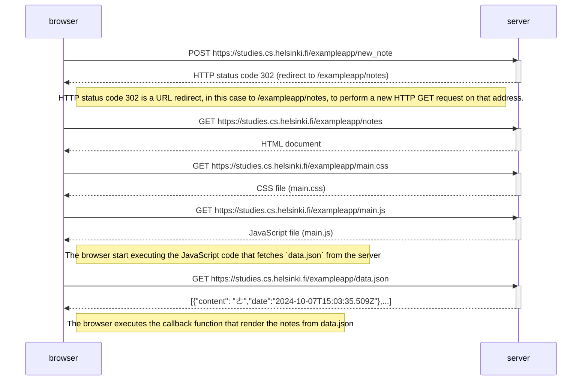

```mermaid
sequenceDiagram
    participant browser
    participant server

    browser->>server: POST https://studies.cs.helsinki.fi/exampleapp/new_note
    activate server
    server-->>browser: HTTP status code 302 (redirect to /exampleapp/notes)
    deactivate server

    Note right of browser: HTTP status code 302 is a URL redirect, in this case to /exampleapp/notes, to perform a new HTTP GET request on that address.

    browser->>server: GET https://studies.cs.helsinki.fi/exampleapp/notes
    activate server
    server-->>browser: HTML document
    deactivate server

    browser->>server: GET https://studies.cs.helsinki.fi/exampleapp/main.css
    activate server
    server-->>browser: CSS file (main.css)
    deactivate server

    browser->>server: GET https://studies.cs.helsinki.fi/exampleapp/main.js
    activate server
    server-->>browser: JavaScript file (main.js)
    deactivate server

    Note right of browser: The browser start executing the JavaScript code that fetches `data.json` from the server

    browser->>server: GET https://studies.cs.helsinki.fi/exampleapp/data.json
    activate server
    server-->>browser: [{"content": "ㄜ","date":"2024-10-07T15:03:35.509Z"},...]
    deactivate server

    Note right of browser: The browser executes the callback function that render the notes from data.json
```
