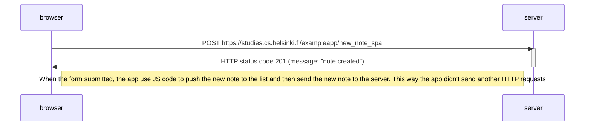

```mermaid
sequenceDiagram
    participant browser
    participant server

    browser->>server: POST https://studies.cs.helsinki.fi/exampleapp/new_note_spa
    activate server
    server-->>browser: HTTP status code 201 (message: "note created")
    deactivate server

    Note right of browser: When the form submitted, the app use JS code to push the new note to the list and then send the new note to the server. This way the app didn't send another HTTP requests
```
